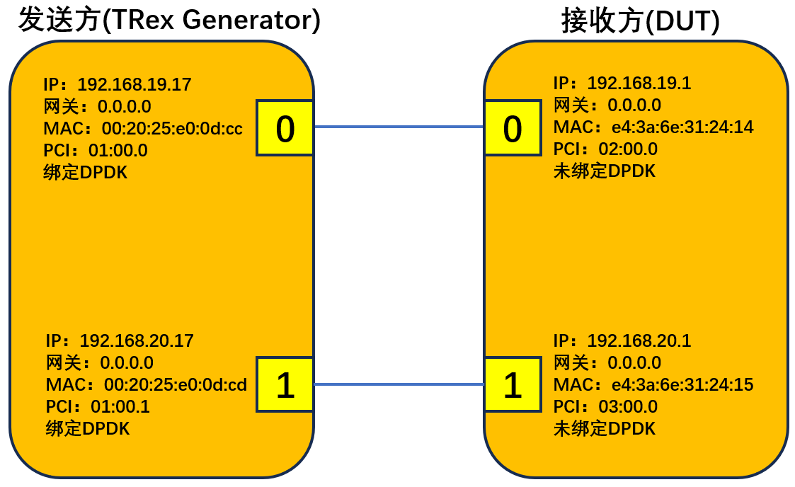
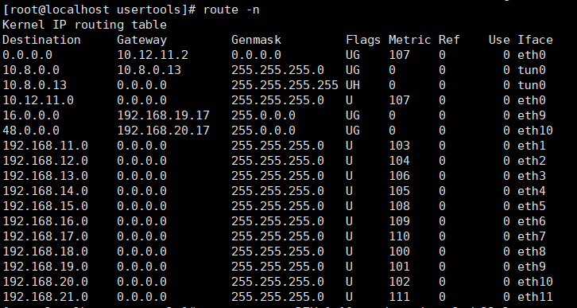
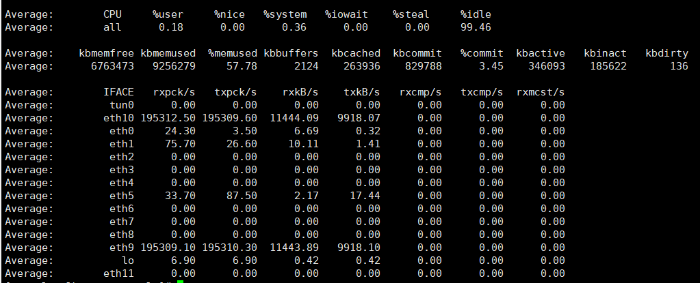
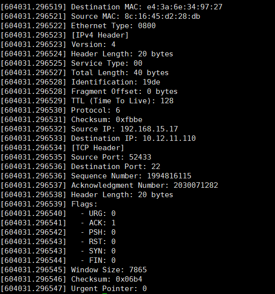

# 用Trex在两主机之间发包，

# Netfilter拦截数据包。


### 1.改电脑IP地址等

电脑ip：192.168.15.17

网关：192.168.15.1

子网掩码：255.255.255.0

DNS：172.16.7.10


### 2.通过xshell连接12网口主机和4网口主机

通过ssh连接它们的eth0接口

12网口：10.12.11.110

4网口：192.168.11.17


### 3.将4网口(12网口)绑定DPDK 

#### 开启防火墙

主机使用trex的时候，主机就会把自己的防火墙关掉。这样，主机的路由转发功能就会受限，上不了外部互联网百度之类的，但是其他功能正常使用。

```
systemctl enable firewalld
systemctl start firewalld
```


#### 本实验只需绑定4网口

<u>4网口</u>

```
modprobe vfio-pci
echo Y | sudo tee /sys/module/vfio/parameters/enable_unsafe_noiommu_mode
cd /home/dpdk/dpdk-stable-20.11.9/usertools/
./dpdk-devbind.py -s
ifconfig eth1 down
ifconfig eth2 down
ifconfig eth3 down
./dpdk-devbind.py --bind=vfio-pci 02:00.0 03:00.0 04:00.0
```

<u>12网口</u>

```
modprobe vfio-pci
cd /home/dpdk/dpdk-stable-20.11.9/usertools/
./dpdk-devbind.py -s
ifconfig eth8 down
ifconfig eth9 down
ifconfig eth10 down
ifconfig eth11 down
./dpdk-devbind.py --bind=vfio-pci 01:00.0 01:00.1 01:00.2 01:00.3
```

`modprobe vfio-pci` 命令用于在Linux中加载用于PCI设备的VFIO（虚拟功能I/O）驱动程序。

VFIO是一个内核模块，允许您将PCI设备（如显卡或网络适配器）分配给虚拟机，以实现更好的性能和对硬件的直接访问。


### 4.将网口解绑DPDK

#### 本实验只用解绑12网口

<u>12网口</u>

```
cd /home/dpdk/dpdk-stable-20.11.9/usertools/
./dpdk-devbind.py -u 01:00.0 01:00.1 01:00.2 01:00.3
./dpdk-devbind.py --bind=i40e 01:00.0 01:00.1 01:00.2 01:00.3
ifconfig eth8 up
ifconfig eth9 up
ifconfig eth10 up
ifconfig eth11 up
```

<u>4网口</u>

```
cd /home/dpdk/dpdk-stable-20.11.9/usertools/
./dpdk-devbind.py -u 02:00.0 03:00.0 04:00.0
./dpdk-devbind.py --bind=igb 02:00.0 03:00.0 04:00.0
ifconfig eth1 up
ifconfig eth2 up
ifconfig eth3 up
```


### 5.Trex配置和使用

#### 配置

```
cd /home/trex/v2.88/
# 自动配置
./dpdk_setup_ports.py -i
# 手动配置
vim /etc/trex_cfg.yaml
```

<u>4网口</u>

```
- version: 2
  interfaces: ['03:00.0', '04:00.0']
  port_info:
      - default_gw: 192.168.19.1 # IP ADDR OF REMOTE DUT MACHINE INTERFACE
        src_mac:    00:20:25:e0:0d:cc #（源MAC地址）
        dst_mac:    e4:3a:6e:31:24:14  #（目标MAC地址）
        ip:         192.168.19.17 # LOCAL TREX DPDK INTERFACE IP
      - default_gw: 192.168.20.1 # IP ADDR OF REMOTE DUT MACHINE INTERFACE
        src_mac:    00:20:25:e0:0d:cd #（源MAC地址）
        dst_mac:    e4:3a:6e:31:24:15  #（目标MAC地址）
        ip:         192.168.20.17 # LOCAL TREX DPDK INTERFACE IP
  platform:
      master_thread_id: 0
      latency_thread_id: 1
      dual_if:
        - socket: 0
          threads: [2,3]
```

<u>12网口</u>

```
- version: 2
  interfaces: ['01:00.1', '01:00.2']
  port_info:
      - default_gw: 192.168.19.17 # IP ADDR OF REMOTE DUT MACHINE INTERFACE
        src_mac:    e4:3a:6e:31:24:14  #（源MAC地址）
        dst_mac:    00:20:25:e0:0d:cc  #（目标MAC地址）
        ip:         192.168.19.1 # LOCAL TREX DPDK INTERFACE IP
      - default_gw: 192.168.20.17 # IP ADDR OF REMOTE DUT MACHINE INTERFACE
        src_mac:    e4:3a:6e:31:24:15  #（源MAC地址）
        dst_mac:    00:20:25:e0:0d:cd  #（目标MAC地址）
        ip:         192.168.20.1 # LOCAL TREX DPDK INTERFACE IP
  platform:
      master_thread_id: 0
      latency_thread_id: 1
      dual_if:
        - socket: 0
          threads: [2,3]
```

#### 使用

<u>监听各个端口的收发包情况</u>

```
./t-rex-64 --software -i
```

<u>运行trex命令终端</u>

```
./trex-console
# 查看端口状态
stats --ps
# 查看实时流量统计数据
tui
# 暂停所有流量发送
pause -a
# 恢复发送流量
resume -a
# 停止所有流量
stop -a
# 退出trex命令终端
exit
```

当执行`tui`命令的时候，报错为`TUI requires console screen size of at least 111x45, current is 158x42`，则说明当前显示屏幕不够大，将Moba拖到显示器上就行。

- `start`命令的参数用法

```
-h, --help 显示此帮助信息并退出
-p PORT[.PROFILE] [PORT[.PROFILE] ...], --port PORT[.PROFILE] [PORT[.PROFILE] ...]
要应用命令的配置文件列表。同一端口上会动态分配多个配置文件ID。配置文件表达式的格式为<端口ID>.<配置文件ID>。如果未指定，默认配置文件ID为"_"。
--total 流量将分配给所有指定的端口
--force 如果要在应用命令之前停止活动端口，请设置此选项。
-f FILE 要使用的文件路径
-d TIME 为作业设置持续时间
-t ..., --tunables ...
为配置文件设置可调参数。-t必须是最后一个标志。
示例："load_profile -f emu/simple_emu.py -t -h" 以查看可调参数帮助
-m MULT, --multiplier MULT
应以以下格式传递乘数：[number][<empty> | bps | kbps | mbps | gbps | pps | kpps | mpps | %]。没有后缀将提供一个绝对因子，百分比将提供线速的百分比。示例：'-m 10'、'-m 10kbps'、'-m 10kbpsl1'、'-m 10mpps'、'-m 23%'。
'-m 23%'：表示23%的L1带宽；
'-m 23mbps'：表示L2带宽（包括FCS+4）中的23mbps；
'-m 23mbpsl1'：表示L1带宽中的23mbps。
-n, --dry 干运行 - 不会注入流量
--pin 将核心分配给接口 - 核心将在接口之间分配（对于对称配置文件的性能提升）
--core_mask CORE_MASK [CORE_MASK ...] 核心掩码 - 只有响应于位掩码的核心将处于活动状态
--sync 以相邻端口的同步时间运行流量。需要确保有效的IPG至少为1000微秒。
```

*示例：*

*启动端口1，并使用stl/udp_1pkt_simple.py生成流量，带宽为100mbps*

```
start -p 1 -f stl/udp_1pkt_simple.py -m 100mbps
```


### 6.使用示例

#### 硬件构成



##### 接收方（12网口）：

```
# 具体配置情况取决于发送方执行的文件，比如这里的udp_1pkt_simple.py
# 数据包的目标IP地址在16.0.0.0/8这个范围内，就将这些数据包发送到192.168.18.1这个网关
route add -net 16.0.0.0 netmask 255.0.0.0 gw 192.168.19.17
route add -net 48.0.0.0 netmask 255.0.0.0 gw 192.168.20.17
```

以上为临时添加，重启后消失

查看路由：route -n

删除路由规则示例：route -v delete -net 16.0.0.0 netmask 255.0.0.0 gw 192.168.18.1

结果如图：



##### 发送方（4网口）：

```
cd /home/trex/v2.88/
./t-rex-64 --software -i
```

###### 再另起一个4网口终端：

```
cd /home/trex/v2.88/
./trex-console
# 开启混杂模式，否则trex可能找不到与之相连接的端口
portattr -a --prom on
# 发送方所有端口同时向接收方发送UDP报文，每个端口的流量均为100mbps
# 端口0向接收方端口0发送(src,dst)=[16.0.0.1,48.0.0.1]的数据包
# 端口1向接收方端口1发送(src,dst)=[48.0.0.1,16.0.0.1]的数据包
# 接收方端口0接收到(src,dst)=[16.0.0.1,48.0.0.1]的数据包转发至内核，内核根据路由规则通过端口1发送给发送方的端口1
# 接收方端口1接收到(src,dst)=[48.0.0.1,16.0.0.1]的数据包转发至内核，内核根据路由规则通过端口0发送给发送方的端口0
start -f stl/udp_1pkt_simple_bdir.py -m 100mbps
```

#### 运行效果：


##### 12网口记录cpu、系统内存、带宽的使用变化情况，每秒1次，记录10次，并保存至指定位置

```
# 记录cpu、系统内存、带宽的使用变化情况，每秒1次，记录10次，并保存至指定位置
sar -u 1 10 -o /root/zzt/result/cpu-logs
sar -r 1 10 -o /root/zzt/result/mem-logs
sar -n DEV 1 10 -o /root/zzt/result/bandwidth-logs

# 三种参数同时记录并保存
sar -u -r -n DEV 1 10 -o /root/zzt/result/all-logs
```

##### 结果如下




### sar操作详情

`sysstat`是一个性能监控工具，它可以收集和报告Linux系统的各种性能指标，包括CPU、内存、网络、磁盘等方面的数据。

下面是一些常用的`sar`命令选项：

- `-u`：显示CPU使用情况。

  - `user`：用户空间进程占用CPU的百分比。

  - `system`：内核空间进程占用CPU的百分比。

  - `iowait`：等待I/O操作完成的时间占用CPU的百分比。

  - `idle`：空闲时间占用CPU的百分比。

  - `steal`：被虚拟化层“偷走”的时间占用CPU的百分比。

  - `guest`：运行虚拟机的时间占用CPU的百分比。

  - `gnice`：以普通用户权限运行的nice值高的进程所占用CPU的百分比。

    

- `-r`：显示内存使用情况。

  - `kbmemfree`：表示空闲的物理内存大小，单位为 KB。

  - `kbmemused`：表示已经使用的物理内存大小，单位为 KB。

  - `%memused`：表示已经使用的物理内存百分比。

  - `kbbuffers`：表示用于缓存数据的内存大小，单位为 KB。

  - `kbcached`：表示用于缓存文件系统数据的内存大小，单位为 KB。

  - `kbcommit`：表示已经分配但尚未写入磁盘的内存大小，单位为 KB。

  - `%commit`：表示已经分配但尚未写入磁盘的内存百分比。

  - `kbactive`：表示活跃的内存大小，单位为 KB。

  - `kbinact`：表示不活跃的内存大小，单位为 KB。

  - `kbdirty`：表示脏页的内存大小，单位为 KB。

- `-b`：显示磁盘 I/O 使用情况。

- `-n DEV`：显示网络使用情况。

  - `IFACE`：表示网络设备的名称。
  - `rxpck/s`：表示每秒钟接收到的数据包数量。
  - `txpck/s`：表示每秒钟发送的数据包数量。
  - `rxkB/s`：表示每秒钟接收到的数据量，单位是 KB。
  - `txkB/s`：表示每秒钟发送的数据量，单位是 KB。
  - `rxcmp/s`：表示每秒钟接收到的压缩数据包数量。
  - `txcmp/s`：表示每秒钟发送的压缩数据包数量。
  - `rxmcst/s`：表示每秒钟接收到的多播数据包数量。
  - `%ifutil`：表示网络设备的使用率，即网络设备被使用的时间占总时间的百分比。

- `-d`：显示磁盘使用情况。

- `-q`：显示运行队列和负载平衡器信息。

- `-P`：指定CPU编号，例如`-P ALL`表示显示所有CPU的使用情况。 `-P 0,2,4` 表示查看编号为 0、2、4 的 CPU 的使用情况。

  - `%usr`：表示用户空间占用 CPU 时间百分比。
  - `%nice`：表示低优先级用户空间占用 CPU 时间百分比。
  - `%sys`：表示内核空间占用 CPU 时间百分比。
  - `%iowait`：表示 CPU 等待 I/O 操作占用 CPU 时间百分比。
  - `%irq`：表示硬件中断占用 CPU 时间百分比。
  - `%soft`：表示软件中断占用 CPU 时间百分比。
  - `%steal`：表示被虚拟化程序“偷走”的 CPU 时间百分比。
  - `%guest`：表示运行虚拟机时占用 CPU 时间百分比。
  - `%gnice`：表示低优先级运行虚拟机时占用 CPU 时间百分比。
  - `%idle`：表示空闲 CPU 时间百分比。

创建个文件夹保存这些信息：

```
mkdir /root/zzt/result
```

选择需要记录的信息，并进行保存：

```
# 记录cpu、系统内存、带宽的使用变化情况，每秒1次，记录10次，并保存至指定位置
sar -u 1 10 -o /root/zzt/result/cpu-logs
sar -r 1 10 -o /root/zzt/result/mem-logs
sar -n DEV 1 10 -o /root/zzt/result/bandwidth-logs

# 三种参数同时记录并保存
sar -u -r -n DEV 1 10 -o /root/zzt/result/all-logs
```

将生成的文件转化为csv文件

```
sadf -d /root/zzt/result/cpu-logs -- -u > /root/zzt/result/cpu-logs.csv
sadf -d /root/zzt/result/mem-logs -- -r > /root/zzt/result/mem-logs.csv
sadf -d /root/zzt/result/bandwidth-logs -- -n DEV > /root/zzt/result/bandwidth-logs.csv

# 将sar保存的文件，选择三种参数进行转化为csv文件
sadf -d /root/zzt/result/all-logs -- -u -r -n DEV > /root/zzt/result/all-logs.csv
```

将生成的文件转化为svg

```
# 将sar保存的文件，选择三种参数进行转化为svg图片，浏览器打开
sadf -g /root/zzt/result/all-logs -- -u -r -n DEV > /root/zzt/result/all-logs.csv
```


### 7.Netfilter

#### 代码一：

**描述：**这个内核模块不会阻止或过滤传入的数据包，而只是将经过 IPv4 网络层 **NF_INET_LOCAL_IN 节点**的数据包，记录一些信息并将数据包继续传递给上层协议栈，以便正常处理。

源代码如下：

文件名：**nf_test.c**

```
#include <linux/module.h>
#include <linux/kernel.h>
#include <linux/types.h>
#include <linux/skbuff.h>
#include <linux/ip.h>
#include <linux/udp.h>
#include <linux/tcp.h>
#include <linux/netfilter.h>
#include <linux/netfilter_ipv4.h>

MODULE_LICENSE("GPLv3");
MODULE_AUTHOR("zzt");
MODULE_DESCRIPTION("Netfliter Capture Packet and Analyse");

// 这里声明了一个名为 nf_test_in_hook 的函数，该函数将被用作Netfilter钩子来处理传入的数据包。
static unsigned int nf_test_in_hook(unsigned int hook, struct sk_buff *skb, const struct net_device *in,
           const struct net_device *out, int (*okfn)(struct sk_buff*));

// 这里定义了一个 nf_hook_ops 结构体数组，描述了Netfilter钩子的操作。
// 这个数组中包含一个钩子操作的配置信息，包括使用的钩子函数 nf_test_in_hook，协议族为IPv4，钩子号为 NF_INET_LOCAL_IN，以及优先级为 NF_IP_PRI_FIRST。
static struct nf_hook_ops nf_test_ops[] __read_mostly = {
{
.hook = nf_test_in_hook,
.owner = THIS_MODULE,
.pf = NFPROTO_IPV4,
.hooknum = NF_INET_LOCAL_IN,
.priority = NF_IP_PRI_FIRST,
},
};

// 这些宏用于将IPv4地址打印成点分十进制格式。
#define NIPQUAD(addr) \
((unsigned char *)&addr)[0], \
((unsigned char *)&addr)[1], \
((unsigned char *)&addr)[2], \
((unsigned char *)&addr)[3]
#define NIPQUAD_FMT "%u.%u.%u.%u"

// 这是Netfilter钩子函数，用于处理传入的IPv4数据包。
// 解析完数据包,它返回 NF_ACCEPT 表示它将数据包传递给了网络堆栈中的下一个处理步骤。
// 如果将NF_ACCEPT替换为NF_DROP，则表示将数据包丢弃，将不能送到主机。
static unsigned int nf_test_in_hook(unsigned int hook, struct sk_buff *skb, const struct net_device *in,
           const struct net_device *out, int (*okfn)(struct sk_buff*)) {
struct ethhdr *eth_header;
struct iphdr *ip_header;

eth_header = eth_hdr(skb);
ip_header = ip_hdr(skb);

// 打印以太网头部信息
printk("[Ethernet Header]\n");
printk("Destination MAC: %02x:%02x:%02x:%02x:%02x:%02x\n",
eth_header->h_dest[0], eth_header->h_dest[1], eth_header->h_dest[2],
eth_header->h_dest[3], eth_header->h_dest[4], eth_header->h_dest[5]);
printk("Source MAC: %02x:%02x:%02x:%02x:%02x:%02x\n",
eth_header->h_source[0], eth_header->h_source[1], eth_header->h_source[2],
eth_header->h_source[3], eth_header->h_source[4], eth_header->h_source[5]);
printk("Ethernet Type: %04x\n", ntohs(eth_header->h_proto));

// 打印IPv4头部信息
printk("[IPv4 Header]\n");
printk("Version: %u\n", ip_header->version);
printk("Header Length: %u bytes\n", ip_header->ihl * 4);
printk("Service Type: %02x\n", ip_header->tos);
printk("Total Length: %u bytes\n", ntohs(ip_header->tot_len));
printk("Identification: %04x\n", ntohs(ip_header->id));
printk("Fragment Offset: %u bytes\n", (ntohs((ip_header)->frag_off) & 0x1FFF) * 8);
printk("TTL (Time To Live): %u\n", ip_header->ttl);
printk("Protocol: %u\n", ip_header->protocol);
printk("Checksum: 0x%04x\n", ntohs(ip_header->check));
printk("Source IP: " NIPQUAD_FMT "\n", NIPQUAD(ip_header->saddr));
printk("Destination IP: " NIPQUAD_FMT "\n", NIPQUAD(ip_header->daddr));

// 根据协议类型解析TCP或UDP头部
if (ip_header->protocol == IPPROTO_TCP) {
struct tcphdr *tcp_header = (struct tcphdr *)(skb_transport_header(skb));
printk("[TCP Header]\n");
printk("Source Port: %u\n", ntohs(tcp_header->source));
printk("Destination Port: %u\n", ntohs(tcp_header->dest));
printk("Sequence Number: %u\n", ntohl(tcp_header->seq));
printk("Acknowledgment Number: %u\n", ntohl(tcp_header->ack_seq));
printk("Header Length: %u bytes\n", tcp_header->doff * 4);
printk("Flags:\n");
printk("  - URG: %u\n", (tcp_header->urg) ? 1 : 0);
printk("  - ACK: %u\n", (tcp_header->ack) ? 1 : 0);
printk("  - PSH: %u\n", (tcp_header->psh) ? 1 : 0);
printk("  - RST: %u\n", (tcp_header->rst) ? 1 : 0);
printk("  - SYN: %u\n", (tcp_header->syn) ? 1 : 0);
printk("  - FIN: %u\n", (tcp_header->fin) ? 1 : 0);
printk("Window Size: %u\n", ntohs(tcp_header->window));
printk("Checksum: 0x%04x\n", ntohs(tcp_header->check));
printk("Urgent Pointer: %u\n", ntohs(tcp_header->urg_ptr));
} else if (ip_header->protocol == IPPROTO_UDP) {
struct udphdr *udp_header = (struct udphdr *)(skb_transport_header(skb));
printk("[UDP Header]\n");
printk("Source Port: %u\n", ntohs(udp_header->source));
printk("Destination Port: %u\n", ntohs(udp_header->dest));
printk("Length: %u bytes\n", ntohs(udp_header->len));
printk("Checksum: 0x%04x\n", ntohs(udp_header->check));
}

return NF_ACCEPT;
}

// 模块的初始化函数，用于在模块加载时注册Netfilter钩子。
static int __init init_nf_test(void) {
int ret;
ret = nf_register_hooks(nf_test_ops, ARRAY_SIZE(nf_test_ops));
if (ret < 0) {
printk("register nf hook fail\n");
return ret;
}
printk(KERN_NOTICE "register nf test hook\n");
return 0;
}

// 模块的退出函数，用于在模块卸载时注销Netfilter钩子。
static void __exit exit_nf_test(void) {
nf_unregister_hooks(nf_test_ops, ARRAY_SIZE(nf_test_ops));
}

// 这些宏用于指定模块的初始化和卸载函数。
module_init(init_nf_test);
module_exit(exit_nf_test);
```

Makefile文件

```
obj-m := nf_test.o

all:
	make -C /lib/modules/$(shell uname -r)/build M=$(PWD) modules

clean:
	make -C /lib/modules/$(shell uname -r)/build M=$(PWD) clean

```

###### 执行

- 创建一个文件夹，并将上述两份代码放入该文件夹内
- 为代码赋予可执行权限

```
chmod +x nf_test.c
```

如果出现以下错误：

```
make[1]: *** /lib/modules/5.15.61-v8+/build: No such file or directory. 
Stop.
```

则说明没有对应的内核模块，则需要下载

```
yum install kernel-devel-$(uname -r)
```

- 将生成的内核模块进行挂载，假设文件名为nf_test.ko

```
sudo insmod nf_test.ko
```

- 使用`lsmod`命令检查内核模块是否已加载：

```
lsmod | grep nf_test
```

如果成功加载，应该会看到该内核模块`nf_test`相关的信息。


- 查看抓包结果， 查看系统消息日志的最后10行

```
dmesg|tail
```


不嫌输出太多，可以直接执行`dmesg`



- 使用`rmmod`命令卸载内核模块：

```
sudo rmmod nf_test
```

